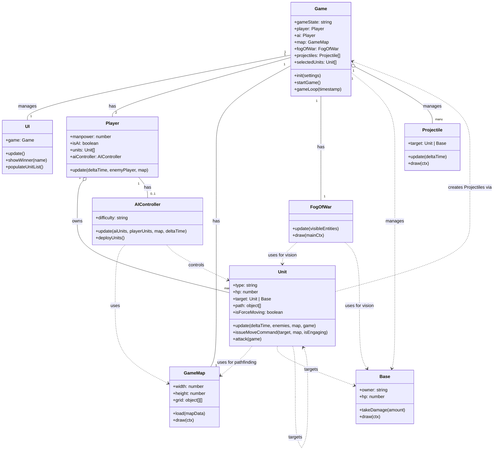

## 游戏核心机制说明
我们的项目是一款基于现代战争背景的2D实时战略（RTS）游戏。其核心机制旨在融合经典的RTS操控体验与现代化的战争单位，为玩家提供富有深度和策略性的对抗。
#### 1. 核心玩法循环：
游戏分为三个 distinct 阶段：
* 设置阶段： 玩家选择游戏模式（如对攻、进攻、防守）、地图、AI难度和游戏速度。
* 部署阶段： 玩家在地图的指定区域内，使用初始资源“兵力（Manpower）”购买并部署单位。此阶段单位无法移动或攻击，强调战前的策略布局。
* 战斗阶段： 玩家点击“开始战斗”后进入此阶段。单位获得行动能力，玩家可以指挥单位进行移动、攻击和执行战术。游戏目标根据所选模式决定，通常围绕摧毁敌方基地或全歼敌军展开。
#### 2. 资源与单位系统：
* 资源： “兵力”是唯一的资源，用于部署单位。管理和分配资源是游戏的关键。
* 单位： 游戏包含四大兵种类别：步兵、装甲、飞行单位和炮兵，每个类别下有多种定位不同的单位（如狙击手、主战坦克、攻击直升机、榴弹炮等）。单位具有生命值、攻击力、防御力、射程、视野和移动类型（地面、空中、两栖）等属性，形成了丰富的克制关系。
#### 3. 操控与战斗逻辑：
* 操控： 游戏采用了经典的RTS操控方案。左键用于选择单位、框选部队以及下达强制移动指令；右键作为智能指令键，用于攻击敌方目标或移动至指定地点。
自动接战： 单位拥有独立的视野范围，会自动发现并攻击进入视野的敌方单位。如果敌人在射程之外，单位会自动移动前去接敌，直至敌人进入其最大射程后停下开火。
* 战争迷雾： 地图大部分区域被战争迷雾覆盖，玩家只能通过单位的视野（通常为其射程的1.5倍）来驱散迷雾，获取战场信息。
#### 4. AI系统：
游戏内置了从“简单”到“地狱”多种难度的AI。高难度AI不仅拥有资源优势，还具备更复杂的宏观战略（如组织波次进攻、优先攻击高价值目标）和微观操作（如集火），为玩家提供持续的挑战。

## 代码结构

以下是项目核心模块的职责划分：
#### 1. Game 模块 
定位: 主循环控制器。
核心职责:
* 状态管理: 封装并管理游戏的核心状态，包括游戏阶段（部署、战斗、结束）、玩家数据及所有动态实体。
* 生命周期控制: 负责创建和管理 Player、GameMap 及 UI 等核心对象的生命周期。
* 主循环驱动: 运行 gameLoop()，精确地驱动所有游戏对象的逻辑更新和渲染 。
* 实体管理: 动态管理战场上的瞬时实体，如 Projectile（炮弹），并处理其物理交互与销毁。
#### 2. Player 模块
定位: 对游戏中任一参与方（人类玩家或AI）的数据与行为的抽象。
核心职责:
* 数据封装: 管理玩家专属的数据，如资源以及其所拥有的单位集合。
* AI集成: 作为AI逻辑的容器，当玩家为AI时，该模块会聚合一个 AIController 实例来执行决策。
* 接口提供: 为上层（如 Game 模块）提供查询和操作玩家状态的接口。
#### 3. AIController 模块 
定位: 封装AI玩家所有战略与战术决策的独立逻辑层。
核心职责:
* 策略实现: 根据预设的难度等级 (difficulty)，执行不同的宏观与微观控制算法。
* 环境分析: 持续分析战场态势（敌我单位的分布、状态等），为AI单位生成最优的行动指令（如移动、攻击、集火）。
* 行为驱动: 将决策结果转化为对具体 Unit 对象的命令。
#### 4. Unit 模块 
定位: 战场上所有可交互作战单位（如步兵、载具、飞行器）的基类。
核心职责:
* 属性管理: 维护单位的独立状态属性，包括生命值 (hp)、攻击目标 (target)、位置、移动路径 (path) 等。
* 模块交互: 与 GameMap 模块交互以实现导航，并通过 Game 模块的接口来实例化 Projectile 等效果。
#### 5. UI 模块 
定位: 负责游戏所有图形用户界面（GUI）的渲染与交互。
核心职责:
* 信息呈现: 将游戏核心逻辑层 (Game 模块) 的数据可视化，如资源数量、单位信息、游戏状态等。
* 输入处理: 捕获并处理来自UI组件的用户输入事件（如按钮点击），并将操作意图传递给 Game 模块。
#### 6. 环境模块 
定位: 定义并管理游戏的虚拟物理环境。
核心职责:
* GameMap: 管理静态的战场环境，包括地形网格、通行规则和障碍物数据，并为 Unit 模块提供高效的寻路算法支持。
* FogOfWar: 实现战争迷雾系统，根据玩家单位的视野范围，动态计算并渲染地图的可见区域，是战场信息控制的核心。
#### 7. 实体模块 
定位: 代表战场上除 Unit 之外的其他关键游戏对象。
核心职责:
* Base: 代表玩家的基地，是游戏中一个高价值的、不可移动的静态战略目标。
* Projectile: 代表子弹、导弹等瞬时飞行道具。该模块负责管理其运动轨迹、碰撞检测以及命中后的伤害计算逻辑。