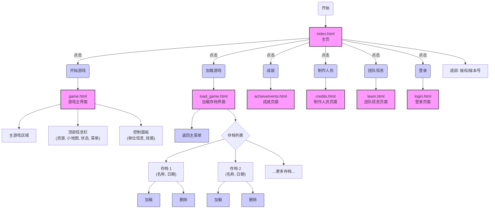
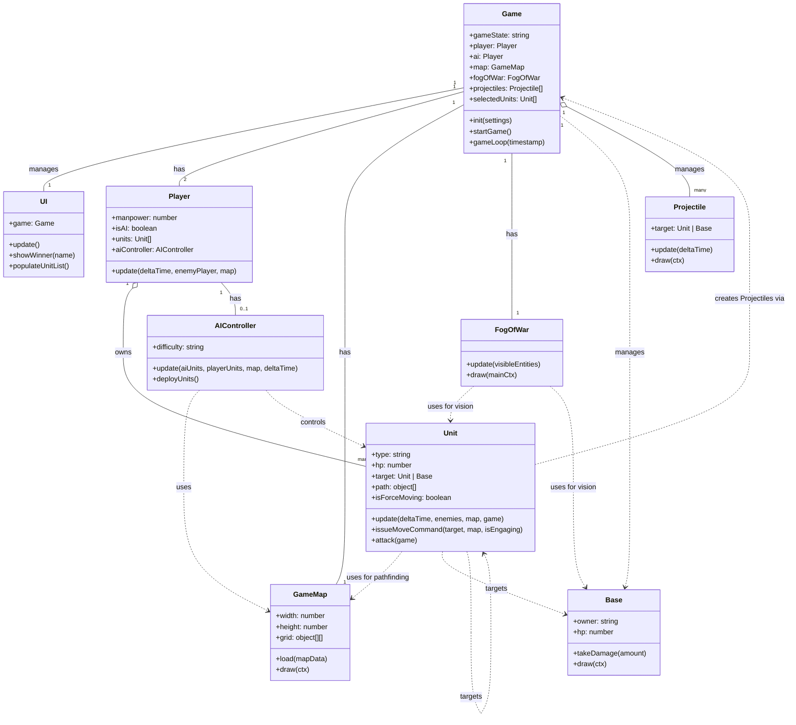

### Our RTS Game
---
#### Site map

```mermaid
graph TD
    %% 主页导航部分
    Start(开始) --> HomePage[index.html<br/>主页];
    HomePage -->|点击| StartGameButton(开始游戏);
    HomePage -->|点击| LoadGameButton(加载游戏);
    HomePage -->|点击| AchievementsButton(成就);
    HomePage -->|点击| CreditsButton(制作人员);
    HomePage -->|点击| TeamButton(团队信息);
    HomePage -->|点击| LoginButton(登录);
    HomePage --> Footer[底部: 版权/版本号];

    %% 游戏主界面概览
    StartGameButton --> GamePage[game.html<br/>游戏主界面];
    GamePage --> GameArea[主游戏区域];
    GamePage --> TopBar["顶部信息栏<br/>(资源, 小地图, 状态, 菜单)"];
    GamePage --> ControlPanel["控制面板<br/>(单位信息, 技能)"];

    LoadGameButton --> LoadGamePage[load_game.html<br/>加载存档界面];
    LoadGamePage --> BackToHome[返回主菜单];
    %%LoadGamePage --> LoadTitle[<h2>加载游戏</h2>];
    LoadGamePage --> SaveList{存档列表};
    SaveList --> Save1["存档 1\n(名称, 日期)"];
    Save1 --> Load1[加载];
    Save1 --> Delete1[删除];
    SaveList --> Save2["存档 2\n(名称, 日期)"];
    Save2 --> Load2[加载];
    Save2 --> Delete2[删除];
    SaveList --> SaveMore["...更多存档..."];
    

    AchievementsButton --> AchievementsPage[achievements.html<br/>成就页面];
    CreditsButton --> CreditsPage[credits.html<br/>制作人员页面];
    TeamButton --> TeamPage[team.html<br/>团队信息页面];
    LoginButton --> LoginPage[login.html<br/>登录页面];

    classDef page fill:#f9f,stroke:#333,stroke-width:2px;
    class HomePage,GamePage,LoadGamePage,AchievementsPage,CreditsPage,TeamPage,LoginPage page;

    classDef button fill:#ccf,stroke:#333,stroke-width:1px;
    class StartGameButton,LoadGameButton,AchievementsButton,CreditsButton,TeamButton,LoginButton,Load1,Delete1,Load2,Delete2,BackToHome button;
```
#### Game Class map

```mermaid
classDiagram
    class Game {
    +gameState: string
    +player: Player
    +ai: Player
    +map: GameMap
    +fogOfWar: FogOfWar
    +projectiles: Projectile[]
    +selectedUnits: Unit[]
    +init(settings)
    +startGame()
    +gameLoop(timestamp)
    }

    class UI {
    +game: Game
    +update()
    +showWinner(name)
    +populateUnitList()
    }

    class Player {
    +manpower: number
    +isAI: boolean
    +units: Unit[]
    +aiController: AIController
    +update(deltaTime, enemyPlayer, map)
    }

    class AIController {
    +difficulty: string
    +update(aiUnits, playerUnits, map, deltaTime)
    +deployUnits()
    }

    class Unit {
    +type: string
    +hp: number
    +target: Unit | Base
    +path: object[]
    +isForceMoving: boolean
    +update(deltaTime, enemies, map, game)
    +issueMoveCommand(target, map, isEngaging)
    +attack(game)
    }

    class Base {
    +owner: string
    +hp: number
    +takeDamage(amount)
    +draw(ctx)
    }

    class GameMap {
    +width: number
    +height: number
    +grid: object[][]
    +load(mapData)
    +draw(ctx)
    }

    class FogOfWar {
    +update(visibleEntities)
    +draw(mainCtx)
    }

    class Projectile {
    +target: Unit | Base
    +update(deltaTime)
    +draw(ctx)
    }

    Game "1" -- "1" UI : manages
    Game "1" -- "2" Player : has
    Game "1" -- "1" GameMap : has
    Game "1" -- "1" FogOfWar : has
    Game "1" ..> Base : manages
    Game "1" o-- "many" Projectile : manages

    Player "1" o-- "many" Unit : owns
    Player "1" -- "0..1" AIController : has

    AIController ..> GameMap : uses
    AIController ..> Unit : controls

    Unit ..> GameMap : uses for pathfinding
    Unit ..> Game : creates Projectiles via
    Unit ..> Base : targets
    Unit ..> Unit : targets

    FogOfWar ..> Unit : uses for vision
    FogOfWar ..> Base : uses for vision
```