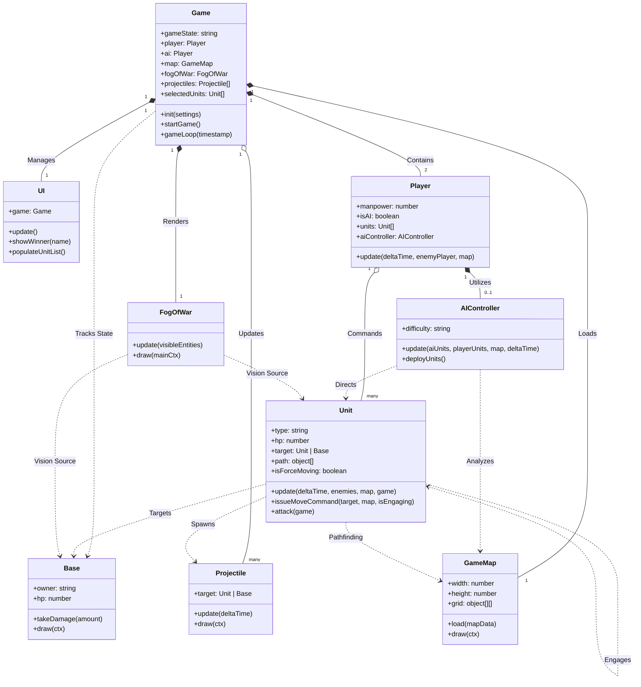

# ⚔️ WebRTS: Tactical Warfare

<div align="center">

<!-- MAIN HEADER IMAGE: Replace with your best gameplay screenshot -->


<br/><br/>

<!-- BADGES -->
[](https://app.netlify.com/sites/rts-game1/deploys)
[](https://opensource.org/licenses/MIT)
[](https://developer.mozilla.org/en-US/docs/Web/JavaScript)
[](https://developer.mozilla.org/en-US/docs/Games)
[](http://makeapullrequest.com)

<h3>
  <a href="https://rts-game1.netlify.app/">🎮 PLAY LIVE DEMO</a>
  <span> · </span>
  <a href="https://github.com/twx145/RTS/issues">🐛 Report Bug</a>
</h3>

**Command your army. Manage resources. Dominate the battlefield.**<br/>
A browser-based Real-Time Strategy game built with pure JavaScript and HTML5 Canvas.

</div>

---

## 📸 Visual Showcase

### ⚔️ Intense Combat
Engage in massive tank battles. Units automatically target enemies, pathfind around obstacles, and defend your base.

<div align="center">
  <!-- Use the screenshot with the tanks and red circles -->
  
 
</div>

<br/>

### 🌫️ Advanced Fog of War System
Implementation of a dynamic visibility system. Areas outside your units' vision range remain shrouded in darkness, hiding enemy movements.

<div align="center">
  <!-- Use the green circle/black background screenshot here -->
  

</div>

---

## 🎖️ Commanders & Assets

The game features high-quality pixel art structures and distinct character portraits for narrative immersion.

### 👥 The Commanders
Choose your operator. Each character represents a faction with unique visual styles.

| Commander | Eva (Intel) | Viper (Spec Ops) | Tanaka (Defense) |
|:---:|:---:|:---:|:---:|
| |  |  |  |


### 🏗️ Structures & Tech
From `Main Battle Tanks` to `Radar Stations`, build a thriving military base.

<div align="center">
  <!-- You can combine the building sprites into one image or use a few key ones -->
  

</div>

---

## ✨ Key Features

*   **🧠 Smart AI Controller**: The enemy builds bases, harvests resources, and launches coordinated attacks based on difficulty settings.
*   **🗺️ Dynamic Pathfinding**: Units use A* (or similar algorithms) to navigate complex terrain and avoid collisions.
*   **📡 Radar & Recon**: Utilize Radar Stations to clear the Fog of War and reveal distant enemy movements.
*   **💾 Auto-Save System**: Game state is automatically saved to local storage (as seen in the "Game Saved" notification).
*   **🏭 Economy**: Manage Power Plants (`power_generator`) and Storage Depots (`storage_depot`) to sustain your war machine.

---

## 🏗️ Technical Architecture

The game uses a component-based architecture to handle game loops, rendering, and logic updates efficiently.



---

## 🚀 Getting Started

### Prerequisites
*   [Git](https://git-scm.com/)
*   A modern browser (Chrome/Edge/Firefox)

### Installation

1.  **Clone the repo**
    ```bash
    git clone https://github.com/twx145/RTS.git
    cd RTS
    ```

2.  **Run the game**
    Simply open `index.html` in your browser.
    *   *Recommended:* Use a local server (like VS Code "Live Server") to ensure assets load correctly without CORS issues.

---

## 🎮 Controls

| Key/Action | Function |
| :--- | :--- |
| **Left Click** | Select Unit / Structure |
| **Left Drag** | Box Select multiple units |
| **Right Click** | Move / Attack Target |
| **Double Click** | Select all units of same type |
| **Mini-map** | Click to move camera instantly |

---

## 🗺️ Roadmap

- [x] **Core Engine**: Game loop, Rendering, Canvas input.
- [x] **Combat System**: HP, Damage, Projectiles.
- [x] **Visuals**: Pixel art assets & Character portraits.
- [x] **Fog of War**: Visibility system.
- [ ] **Audio**: Sound effects and background music.
- [ ] **Multiplayer**: PvP via WebSockets.
- [ ] **Campaign**: Scripted missions and story mode.

---

<div align="center">
    <strong>Built with ❤️ by twx145</strong>
    <br/>
    <i>Assets used for educational/demonstration purposes.</i>
</div>
